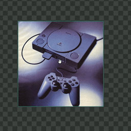
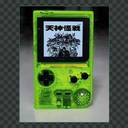
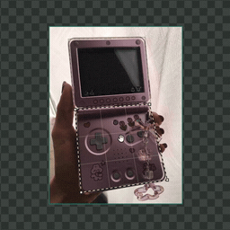
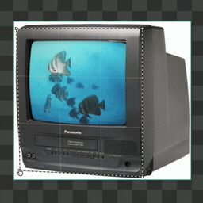
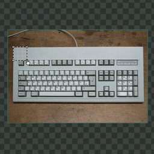
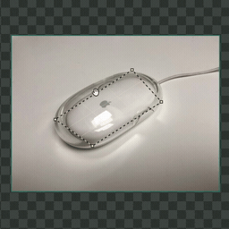

# DinoRip


Desktop texture ripper for building PNG textures and texture atlases from
reference images.

> Attribution: DinoRip is a remake of puck_psx's original texture ripper.
> Please support the original project:
> [Buy the original version](https://puszke.itch.io/pucks-texture-ripper).

## Features

- Load PNG, JPG, and JPEG source images, or paste image files from the clipboard.
- Add perspective rippers, move corners, bend edges, and extract textures.
- Auto-extract edited rippers into the atlas workspace.
- Move, resize, rotate, pack, and size atlas textures.
- Edit texture color with brightness, contrast, saturation, hue shift,
  grayscale, invert, sharpen, posterize, dithering, and saved presets.
- Apply texture adjustments to one texture or all atlas textures.
- Export the selected texture, every texture, or the full atlas as PNG.
- Use undo/redo, pan/zoom, fullscreen, and the in-app shortcuts overlay.

<!-- SHORTCUTS:START -->
<!-- Generated from apps/desktop/src/renderer/shortcuts.data.json by scripts/generate-readme-shortcuts.mjs. Do not edit by hand; run `pnpm gen:shortcuts`. -->
## Shortcuts

> On macOS the modifier is **⌘** (Command); on Windows/Linux it is **Ctrl**.

### General

| Action | Shortcut | Demo |
| --- | --- | --- |
| Undo | ⌘/Ctrl + Z |  |
| Redo | ⇧ + ⌘/Ctrl + Z, or ⌘/Ctrl + Y |  |
| Toggle fullscreen | ⌘/Ctrl + F |  |
| Paste from clipboard | ⌘/Ctrl + V |  |
| Zoom | Mouse wheel |  |
| Pan the view | Middle-drag, or drag empty canvas |  |
| Delete selection | Delete / Backspace |  |

### Ripper

| Action | Shortcut | Demo |
| --- | --- | --- |
| Add a ripper | A |  |
| Extract the ripper | Enter |  |
| Select a ripper | Click it |  |
| Move the ripper | Drag inside the ripper |  |
| Move a corner | Drag a corner |  |
| Scale the ripper | ⌘/Ctrl + drag a corner |  |
| Bend an edge | ⌘/Ctrl + drag an edge |  |
| Reshape a curve | Drag a curve handle |  |
| Remove a curve | Double-click a curve handle |  |
| Add/remove a corner | ⇧ + click a corner |  |
| Move selected corners | Drag a selected corner |  |
| Marquee-select corners | ⇧ + drag empty canvas |  |
| Move a source image | ⇧ + drag the image |  |

> Cmd/Ctrl-scaling or moving the ripper transforms any curve control points along with the corners, so curved edges keep their shape.

### Atlas

| Action | Shortcut | Demo |
| --- | --- | --- |
| Apply adjustments | S |  |
| Select a texture | Click it |  |
| Move a texture | Drag the texture |  |
| Resize a texture | Drag a corner |  |
| Resize one side | Drag an edge |  |
| Resize proportionally | ⇧ + drag a corner |  |
| Rotate a texture | Drag the rotation handle |  |
| Snap rotation to 45° | ⇧ + drag the rotation handle |  |
| Delete the texture | Delete, or Backspace |  |
| Toggle conserve / rectify | Right-click the texture |  |
<!-- SHORTCUTS:END -->

## Development

```sh
pnpm install
pnpm dev
```

Useful checks:

```sh
pnpm typecheck
pnpm test
pnpm lint
pnpm build
```

## Requirements

- Node.js 18+
- pnpm 11+

## License

MIT
