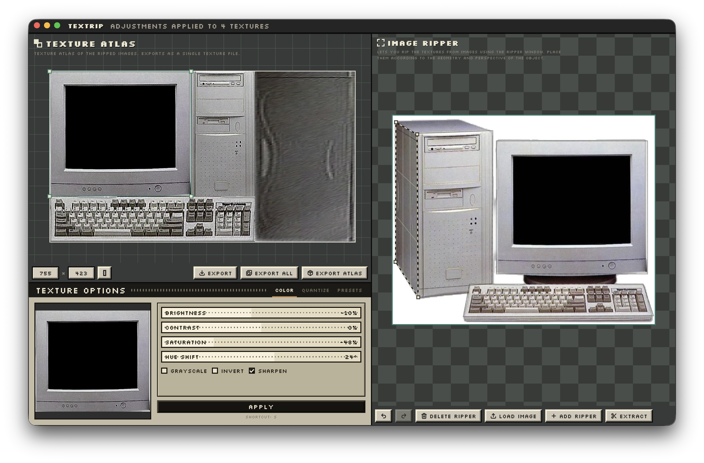
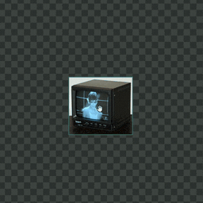

<div align="center">

# 🦖 DinoRip

**A texture ripper & seamless-tile workshop for game artists.**



</div>

DinoRip lets you rip textures out of reference photos and turn them into clean,
tiling texture atlases. Place a perspective ripper over the geometry in an image,
extract the surface into the atlas workspace, adjust it, and export a single
texture file, all in a fast, pixel-styled desktop UI.

It is a clean-room Electron + TypeScript rebuild of a classic texture
ripper / seamless-maker workflow.

## Features

- **Image ripper**: load PNG/JPG/JPEG reference images and place a four-point
  perspective ripper over the object's surface; drag vertices or the whole ripper.
- **Perspective extraction**: sample the ripped quad into a flat texture in the
  atlas workspace.
- **Texture atlas**: move, resize (corners or edges), rotate, and edge-snap
  extracted textures, one-click **Pack** to arrange them tightly, then export
  them as a single atlas file.
- **Texture options**: brightness, contrast, saturation, hue shift, grayscale,
  invert, and sharpen, applied across one or all textures.
- **Seamless tiling**: Smoothed Collage and Scattered Edges seam generation with
  a tiled live preview.
- **Export**: export the selected texture, export all textures, or export the
  full atlas as PNG.

<!-- SHORTCUTS:START -->
<!-- Generated from apps/desktop/src/renderer/shortcuts.data.json by scripts/generate-readme-shortcuts.mjs. Do not edit by hand; run `pnpm gen:shortcuts`. -->
## Shortcuts

> On macOS the modifier is **⌘** (Command); on Windows/Linux it is **Ctrl**.

### General

| Action | Shortcut | Demo |
| --- | --- | --- |
| Undo | ⌘/Ctrl + Z |  |
| Redo | ⇧ + ⌘/Ctrl + Z, or ⌘/Ctrl + Y |  |
| Toggle fullscreen | ⌘/Ctrl + F |  |
| Paste from clipboard | ⌘/Ctrl + V |  |
| Zoom | Mouse wheel |  |
| Pan the view | Middle-drag, or drag empty canvas |  |
| Delete selection | Delete / Backspace |  |

### Ripper

| Action | Shortcut | Demo |
| --- | --- | --- |
| Add a ripper | A |  |
| Extract the ripper | Enter |  |
| Select a ripper | Click it |  |
| Move the ripper | Drag inside the ripper |  |
| Move a corner | Drag a corner |  |
| Scale the ripper | ⌘/Ctrl + drag a corner |  |
| Bend an edge | ⌘/Ctrl + drag an edge |  |
| Reshape a curve | Drag a curve handle |  |
| Remove a curve | Double-click a curve handle |  |
| Add/remove a corner | ⇧ + click a corner |  |
| Move selected corners | Drag a selected corner |  |
| Marquee-select corners | ⇧ + drag empty canvas |  |
| Move a source image | ⇧ + drag the image |  |

> Cmd/Ctrl-scaling or moving the ripper transforms any curve control points along with the corners, so curved edges keep their shape.

### Atlas

| Action | Shortcut | Demo |
| --- | --- | --- |
| Apply adjustments | S |  |
| Select a texture | Click it |  |
| Move a texture | Drag the texture |  |
| Resize a texture | Drag a corner |  |
| Resize one side | Drag an edge |  |
| Resize proportionally | ⇧ + drag a corner |  |
| Rotate a texture | Drag the rotation handle |  |
| Snap rotation to 45° | ⇧ + drag the rotation handle |  |
| Delete the texture | Delete, or Backspace |  |
| Toggle conserve / rectify | Right-click the texture |  |
<!-- SHORTCUTS:END -->

## Project structure

| Path | Description |
| --- | --- |
| `packages/core` | Pure TypeScript: image models, bilinear sampling, perspective extraction, seamless processing, flip/resize, atlas rasterization. |
| `packages/ipc-contracts` | Typed IPC channels and shared constants. |
| `apps/desktop` | Electron main/preload, React + Vite renderer, Canvas workspaces, worker processing, and electron-builder config. |

## Getting started

```sh
pnpm install
pnpm dev
```

`pnpm dev` starts Vite and Electron together.

### Other scripts

```sh
pnpm typecheck   # type-check every package
pnpm test        # run unit tests
pnpm lint        # lint all packages
pnpm build       # build all packages
```

## Packaging

The desktop app packages with [electron-builder](https://www.electron.build/)
for macOS, Windows, and Linux:

```sh
pnpm --filter @dinorip/desktop dist
```

> [!NOTE]
> `sharp` ships platform-specific native binaries, so each OS target must be
> packaged on (or cross-installed for) that platform. Code signing and
> notarization are not configured.

## Requirements

- [Node.js](https://nodejs.org/) 18+
- [pnpm](https://pnpm.io/) 11+

## License

MIT
